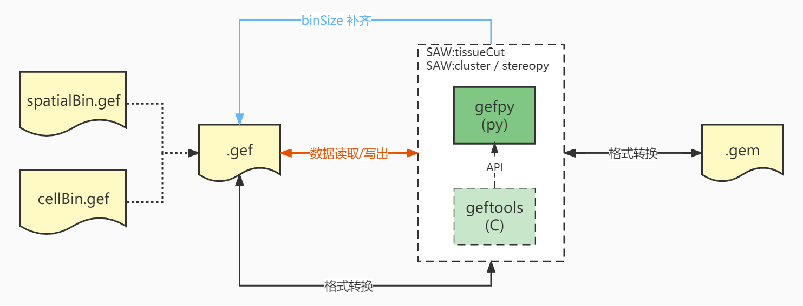

.. gefpy documentation master file, created by
   sphinx-quickstart on Mon Jan 10 17:28:11 2022.
   You can adapt this file completely to your liking, but it should at least
   contain the root `toctree` directive.

.. _topics-index:

Welcome to gefpy's documentation!
=================================

**gefpy** is encapsulated on the basis of geftools functions, 
and then provides a series of python interfaces to facilitate and quickly obtain bgef and cgef file information.

- **bgef Format** <https://www.processon.com/view/link/6274de9c0791290711fa418d#map>
- **cgef Format** <https://www.processon.com/view/link/6258c319f346fb5a269675e8#map>

.. toctree::
   :caption: General
   :maxdepth: 2

   General/Installation
   api

.. toctree::
   :caption: Tutorials
   :maxdepth: 2

   Examples
   release_note

Indices and tables
==================

* :ref:`genindex`
* :ref:`modindex`
